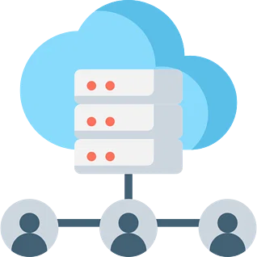

# __Programming-Practice-Article__
## ___Version Control___:
_Version control_ is a system used to track and manage software code changes. A version control system is a software tool used by software development teams to manage code changes over time. (__Source__:  [Altassian](https://www.atlassian.com/git/tutorials/what-is-version-control))

In fast-paced development environments, they make it easier for teams to work efficiently. In these systems, a record of every modification to code is kept in a particular database. When an error occurs in the code, developers can compare previous versions to fix it with minimal disruption to the team. (__Source__:  [Altassian](https://www.atlassian.com/git/tutorials/what-is-version-control))

__Image Source:__ [Simplilearn](https://www.simplilearn.com/ice9/free_resources_article_thumb/Version_Control.png)

## ___Source-Code Version Control___:
_Source code version control_ is a software tool that manages source code files.It provides several essential features-
* It keeps track of the history of code changes, including the author and time of the modifications. 
* It allows the creation of multiple versions of the code, each in its branch, to enable teams to work on different features without disrupting the main code branch.
 * The tool also enables merging changes made in separate branches back into the main code branch and resolves any conflicts that arise during this process. (__Source__:  [Open AI](https://chat.openai.com))

Few Source Code Version Control Systems are Git, Subversion and Mercurial. The suitability of a particular version control system for a project depends on the specific needs of that project, as each system has its own advantages and disadvantages. (__Source__:  [Open AI](https://chat.openai.com))

## ___Importance of Source-Code Version Control___:
1. ### Supervising and Safeguarding the Codebase:
The Version Control System is software teams use to manage their source code effectively. It tracks changes made to the code, enables reverting to previous versions when needed, and reduces errors by allowing developers to review and test modifications before merging them. It is a secure and efficient way to manage and safeguard the source code of a software project. (__Source:__ [Simplilearn](https://www.simplilearn.com/tutorials/devops-tutorial/version-control))

2. ### Maintaining a record of all the changes made to the code:
The project team regularly creates new source code and updates existing code. They keep track of these changes for future use, such as identifying the cause of a problem. This record of modifications can serve as a valuable reference to the team's work history and aid in troubleshooting. (__Source:__ [Simplilearn](https://www.simplilearn.com/tutorials/devops-tutorial/version-control))

__Image Source:__ [Simplilearn](https://www.simplilearn.com/ice9/free_resources_article_thumb/Collaboration.png)

3. ### Analyzing code version history:
Developers can compare previous versions of the code at any time, thanks to the storage of all code iterations. This facilitates the identification of errors and their correction while maintaining the rest of the team's work. This results in a more efficient development process and reduced risk of errors in the final product. (__Source:__ [Simplilearn](https://www.simplilearn.com/tutorials/devops-tutorial/version-control))

__Image Source:__ [Simplilearn](https://www.simplilearn.com/ice9/free_resources_article_thumb/Backup.png)

## ___Version Control Best Practices___:
1. ### Commit Relatively:

A commit should be relative to the work, which means the commit should look understandable with the changes. It should not be a mess of the code. If a person is trying to solve multiple problems, then the commit also should be various means each commit shows the different issues solved. If one commits to delivering all the problems solved, that is not a good practice. (Source:  [Git-Tower](https://www.git-tower.com/learn/git/ebook/en/command-line/appendix/best-practices))

2. ### Commit small but often:

Committing code in small increments reduces the risk of integration conflicts. Regular, small commits and well-documented changes make it easier to revert if conflicts occur. Committing frequently helps keep changes small and focused, allowing for more regular sharing and integration with others. Infrequent, large commits create challenges in resolving disputes and understanding changes. (Source:  [Git-Tower](https://www.git-tower.com/learn/git/ebook/en/command-line/appendix/best-practices), [Gitlab](https://about.gitlab.com/topics/version-control/version-control-best-practices))

3. ### Remember to not commit uncomplete work:
  Only commit code to the repository when it is fully functional. This does not require you to complete a big feature before committing. However, it is recommended to split the implementation of the feature into smaller, manageable chunks and commit early and frequently to keep the code up to date. (Source:  [Git-Tower](https://www.git-tower.com/learn/git/ebook/en/command-line/appendix/best-practices))

4. ### Use of Branches:

Branching is a crucial feature of Git, designed from the beginning to be quick and easy to use. It helps keep different lines of development separate and reduces confusion. To make the most of this feature, branches should be utilized in your development process for various tasks such as adding new features, fixing bugs, conducting experiments or exploring ideas. (Source:  [Git-Tower](https://www.git-tower.com/learn/git/ebook/en/command-line/appendix/best-practices))

